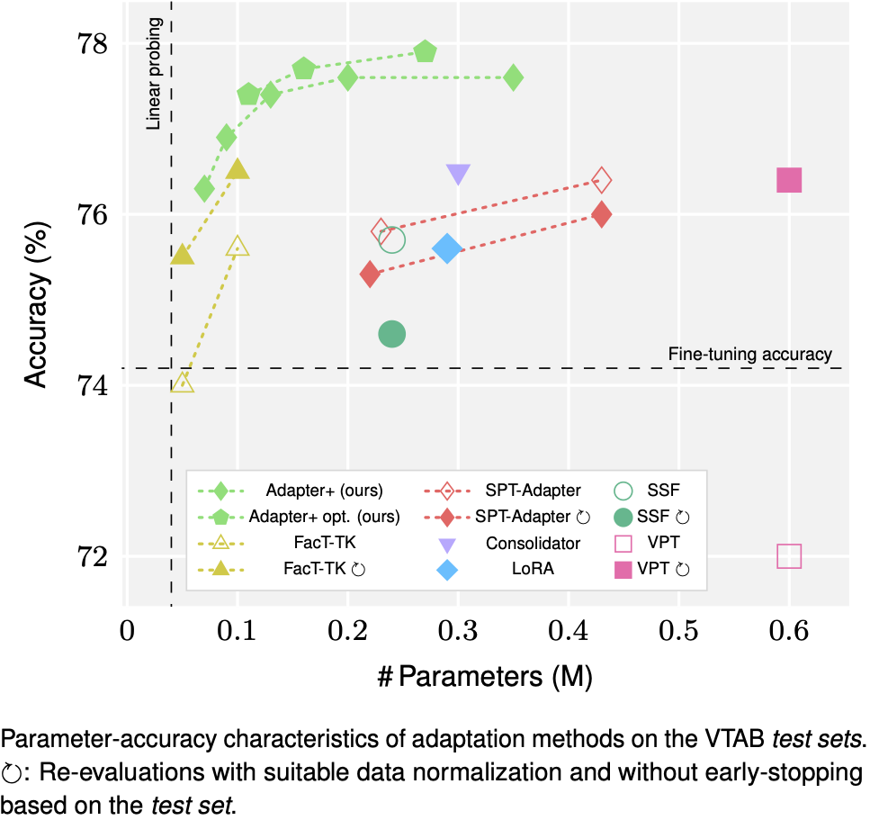

# Adapters Strike Back

[](https://opensource.org/licenses/Apache-2.0)
[](https://pytorch.org/)

This is the official repository of our paper:

**Adapters Strike Back**<br>
[Jan-Martin O. Steitz](https://jmsteitz.de)
and [Stefan Roth](https://www.visinf.tu-darmstadt.de/visual_inference/people_vi/stefan_roth.en.jsp)<br>
*CVPR*, 2024

**Abstract:** Adapters provide an efficient and lightweight mechanism for adapting trained transformer models to a variety of different tasks. However, they have often been found to be outperformed by other adaptation mechanisms, including low-rank adaptation. In this paper, we provide an in-depth study of adapters, their internal structure, as well as various implementation choices. We uncover pitfalls for using adapters and suggest a concrete, improved adapter architecture, called *Adapter+*, that not only outperforms previous adapter implementations but surpasses a number of other, more complex adaptation mechanisms in several challenging settings. Despite this, our suggested adapter is highly robust and, unlike previous work, requires little to no manual intervention when addressing a novel scenario. Adapter+ reaches state-of-the-art average accuracy on the VTAB benchmark, even without a per-task hyperparameter optimization.



## Code and checkpoints
Coming soon!

## Acknowledgements
This work has been funded by the LOEWE initiative (Hesse, Germany) within the [emergenCITY](https://www.emergencity.de/) center.

## Citation
```
@article{Steitz:2024:ASB,
  title = {Adapters Strike Back},
  author = {Jan-Martin O. Steitz and Stefan Roth},
  journal = {arXiv},
  year = {2024}
}
```